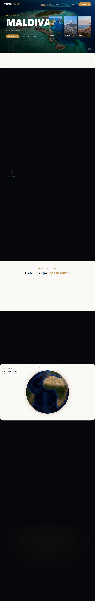
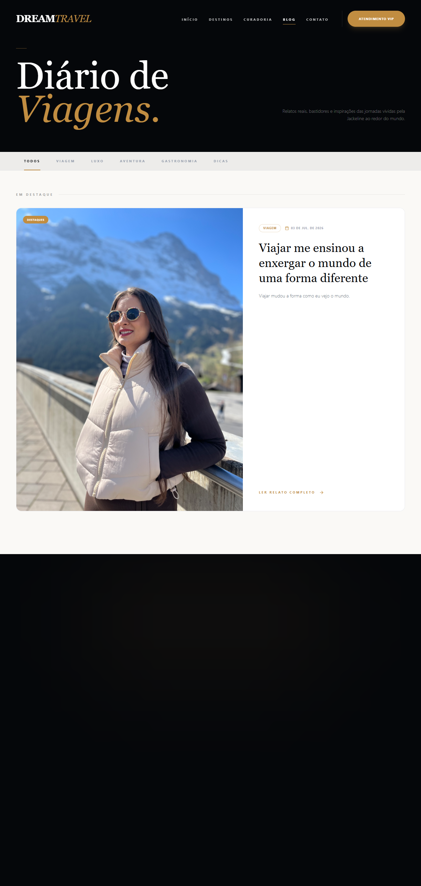
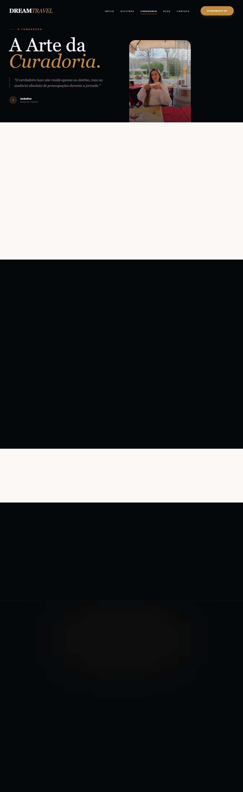
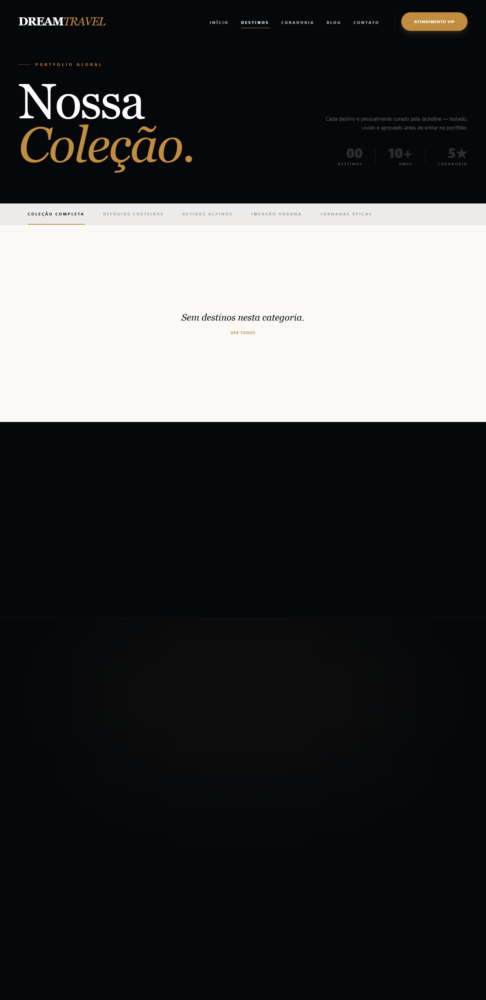
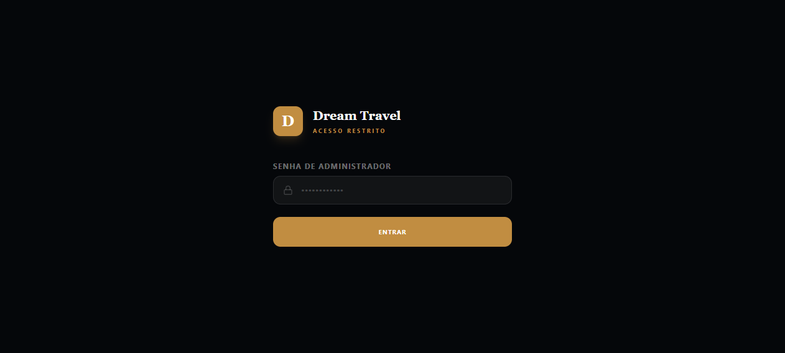

<div align="center">
  

  <br/><br/>

  # DREAM*TRAVEL*
  ### Plataforma de curadoria de viagens de luxo — experiências sob medida para quem exige o extraordinário.

  <br/>

  [](https://dream-travel-viagens.vercel.app)
  &nbsp;
  [](https://vercel.com)
  &nbsp;
  [](https://www.typescriptlang.org/)

</div>

---

## 📸 Capturas do Projecto

<table>
  <tr>
    <td width="50%" valign="top">
      
      <p align="center"><sub>✍️ <strong>Diário de Viagens</strong> — Journal editorial de alto padrão</sub></p>
    </td>
    <td width="50%" valign="top">
      
      <p align="center"><sub>👤 <strong>A Curadora</strong> — Página de apresentação da Jackeline</sub></p>
    </td>
  </tr>
  <tr>
    <td width="50%" valign="top">
      
      <p align="center"><sub>🌍 <strong>Portfólio Global</strong> — Catálogo de destinos exclusivos</sub></p>
    </td>
    <td width="50%" valign="top">
      
      <p align="center"><sub>🔐 <strong>Control Room</strong> — Painel administrativo restrito</sub></p>
    </td>
  </tr>
</table>

---

## ✨ Funcionalidades

| Feature | Descrição |
|---|---|
| 🌍 **Portfólio Global** | Catálogo de destinos com design editorial, filtros por categoria e animações fluidas |
| ✍️ **Journal de Viagens** | Blog com estética de revista de luxo, artigos em destaque e categorias |
| 🔐 **Área VIP do Cliente** | Portal restrito com roteiro personalizado acessível via código exclusivo |
| 🛡️ **Control Room** | Painel admin com CRUD completo de destinos, posts, códigos VIP e newsletter |
| 📧 **Círculo Restrito** | Newsletter com lista de assinantes e exportação CSV |
| 🔑 **Auth Stateless** | Autenticação HMAC-SHA256 sem sessões em memória — compatível com serverless |

---

## 🛠 Stack Tecnológica

**Frontend**


**Backend & Dados**


---

## 🚀 Como Executar Localmente

```bash
# 1. Clonar o repositório
git clone https://github.com/rikelmedev/dream-travel-viagens.git
cd dream-travel-viagens

# 2. Instalar dependências
pnpm install

# 3. Configurar variáveis de ambiente
cp .env.example .env
# Editar .env com DATABASE_URL e ADMIN_PASSWORD

# 4. Iniciar o servidor de desenvolvimento
pnpm dev
```

> O frontend fica em `http://localhost:5173` e a API Express em `http://localhost:3000`.

---

## 📁 Estrutura do Projecto

```
├── api/
│   └── index.ts          # Serverless function única (Vercel)
├── client/
│   └── src/
│       ├── components/   # Componentes reutilizáveis
│       ├── pages/        # Páginas (Home, Destinos, Blog, VIP, Admin)
│       └── contexts/     # Auth context
├── server/
│   ├── app.ts            # Express app (desenvolvimento local)
│   ├── db.ts             # Conexão Drizzle + Supabase
│   └── schema.ts         # Schema das tabelas
└── vercel.json           # Configuração de deploy e rewrites
```

---

<div align="center">
  <sub>Desenvolvido por <a href="https://github.com/rikelmedev">Rikelme</a> · Plataforma exclusiva para <strong>Dream Travel Viagens</strong></sub>
</div>
